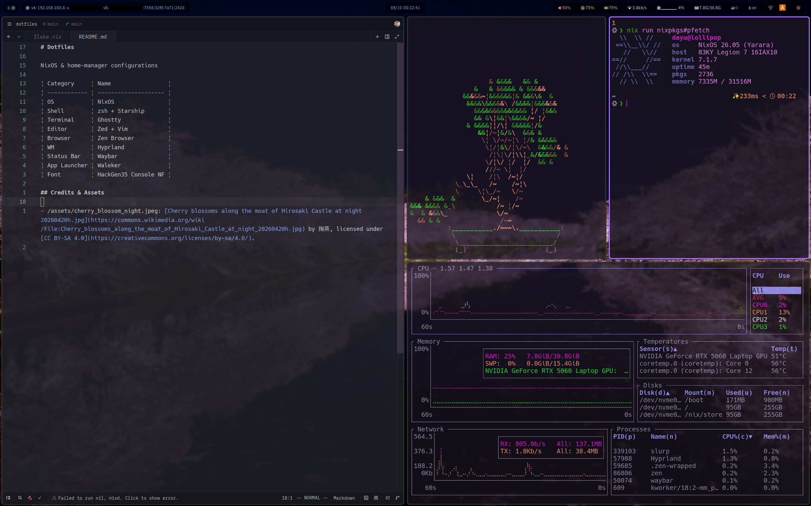

# Dotfiles

My NixOS & home-manager configurations

| Category     | Name                 |
| ------------ | -------------------- |
| OS           | NixOS                |
| Shell        | zsh + Starship       |
| Terminal     | Ghostty              |
| Editor       | Zed + Vim            |
| Browser      | Zen Browser          |
| WM           | Hyprland             |
| Status Bar   | Waybar               |
| App Launcher | Waleker              |
| Font         | HackGen35 Console NF |

## Credits & Assets

- /assets/cherry_blossom_night.jpeg: [Cherry blossoms along the moat of Hirosaki Castle at night 20260420h.jpg](https://commons.wikimedia.org/wiki/File:Cherry_blossoms_along_the_moat_of_Hirosaki_Castle_at_night_20260420h.jpg) by 掬茶, licensed under [CC BY-SA 4.0](https://creativecommons.org/licenses/by-sa/4.0/).
