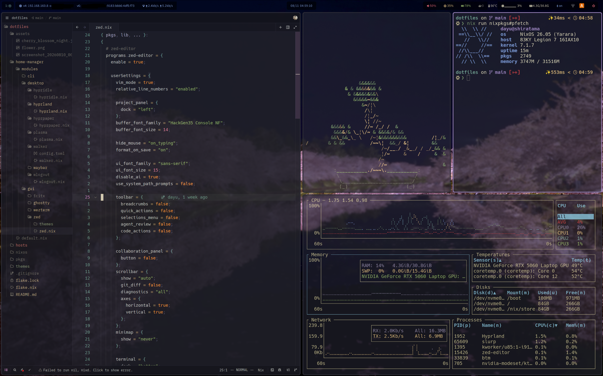

# ❄Dotfiles

My NixOS & home-manager configurations



| Category     | Name                 |
| ------------ | -------------------- |
| OS           | NixOS                |
| Shell        | zsh + Starship       |
| Terminal     | Kitty                |
| Editor       | Zed + Vim            |
| Browser      | Zen Browser          |
| WM           | Hyprland             |
| Status Bar   | Waybar               |
| App Launcher | Walker               |
| Font         | HackGen35 Console NF |

## 🚀Installation

### 🙇‍♀️Prerequisites

- nix-command
- flakes
- [nh](https://github.com/nix-community/nh) (Optional)

1. Clone this repository

   ```bash
   git clone git clone https://github.com/dayu255/dotfiles.git ~/dotfiles
   cd ~/dotfiles
   ```

1. Make `hardware-configuration.nix` for your host

   ```bash
   mkdir -p hosts/$HOST
   nixos-generate-config --show-hardware-config > hosts/$HOST/hardware-configuration.nix
   ```

1. Edit `flake.nix` to change your username

   ```nix
   let
     # === const variables ===
     system = "x86_64-linux";
     username = "dayu";         # Change Here!
     # =======================

     pkgs = nixpkgs-stable.legacyPackages.${system};

     pkgs-unstable = import nixpkgs-unstable {
       inherit system;
       config.allowUnfree = true;
     };
     in
   ```

1. Edit `flake.nix` to add profile for your host

   HOSTNAME is `echo $HOST`

   ```nix
   # Nixos
   nixosConfigurations = {
     shiratama = nixpkgs-stable.lib.nixosSystem {
       ...
     };

     # Add Here!
     HOSTNAME = nixpkgs-stable.lib.nixosSystem {
       inherit system;
       specialArgs = {
         inherit inputs;
         inherit username;
       };
       modules = [
         ./nixos/default.nix
         ./hosts/HOSTNAME/hardware-configuration.nix

         # If you want to customize NixOS configuration
         #./hosts/HOSTNAME/configuration.nix
       ];
     };
   };

   # Home-Manager
   homeConfigurations = {
     "${username}@shiratama" = home-manager.lib.homeManagerConfiguration {
       ...
     };

     # Add Here!
     "${username}@HOSTNAME" = home-manager.lib.homeManagerConfiguration {
       pkgs = pkgs-unstable;
       extraSpecialArgs = {
         inherit inputs;
         inherit username;
       };
       modules = [
         ./home-manager/default.nix

         # If you want to custumize home-manager configuration
         #./hosts/HOSTNAME/home.nix
       ];
     };
   };
   ```

1. Apply NixOS Configuration

   ```bash
   sudo nixos-rebuild switch --flake .
   ```

   If `nh` was installed,

   ```bash
   nh os switch .
   ```

1. Apply Home-Manager Configuration

   ```bash
   home-manager switch --flake .
   ```

   If `nh` was installed,

   ```bash
   nh home switch .
   ```

## 📁Directory Structure

```text
dotfiles
├── README.md
├── assets # Images
│   ├── cherry_blossom_night.jpeg
│   ├── flower.png
│   └── etc.
├── flake.nix # Entry point
├── flake.lock
├── hosts # Configurations for each host
│   ├── shiratama
│   │   ├── configuration.nix
│   │   ├── hardware-configuration.nix
│   │   └── home.nix
│   └── newhost
├── home-manager
│   ├── default.nix # Common Home-Manager configuration
│   └── modules # Reusable modules
│       ├── cli # CLI Tools
│       │   ├── git
│       │   │   └── git.nix
│       │   ├── starship
│       │   │   ├── starship.nix
│       │   │   └── starship.toml
│       │   ├── vim
│       │   │   ├── vim.nix
│       │   │   └── vimrc
│       │   ├── zsh
│       │   │     └── zsh.nix
│       │   └── etc.
│       ├── desktop # Desktop environment
│       │   ├── hypridle
│       │   │   └── hypridle.nix
│       │   ├── hyprland
│       │   │   └── hyprland.nix
│       │   ├── hyprpaper
│       │   │   └── hyprpaper.nix
│       │   ├── plasma
│       │   │   └── plasma.nix
│       │   ├── walker
│       │   │   ├── config.toml
│       │   │   └── walker.nix
│       │   ├── waybar
│       │   │   ├── config.jsonc
│       │   │   ├── reload.sh
│       │   │   ├── script
│       │   │   │   ├── docker-container.sh
│       │   │   │   ├── ip-info.sh
│       │   │   │   └── tailscale.sh
│       │   │   ├── style.css
│       │   │   └── waybar.nix
│       │   └── wlogout
│       │       └── wlogout.nix
│       └── gui # GUI applications
│           ├── fcitx
│           │   ├── fcitx.nix
│           │   └── profile
│           ├── kitty
│           │   └── kitty.nix
│           ├── ghostty
│           │   ├── config
│           │   └── ghostty.nix
│           ├── wezterm
│           │   ├── wezterm.lua
│           │   └── wezterm.nix
│           └── zed
│               └── zed.nix
├── nixos
│   ├── default.nix # Common NixOS configuration
│   └── modules # Reusable modules
│       ├── envfs
│       │   └── envfs.nix
│       ├── font
│       │   └── font.nix
│       ├── hyprland
│       │   └── hyprland.nix
│       ├── input
│       │   └── input.nix
│       ├── nix-ld
│       │   └── nix-ld.nix
│       ├── nvidia
│       │   └── nvidia.nix
│       ├── plasma
│       │   └── plasma.nix
│       ├── sddm
│       │   └── sddm.nix
│       └── tailscale
│           └── tailscale.nix
└── pkgs # Home-made tools
  ├── nix-template
  │   ├── flake-template.nix
  │   ├── nix-template.nix
  │   └── nix-template.sh
  └── qrun
      ├── qrun.nix
      └── qrun.sh
```

## ©Credits & Assets

- /assets/cherry_blossom_night.jpeg: [Cherry blossoms along the moat of Hirosaki Castle at night 20260420h.jpg](https://commons.wikimedia.org/wiki/File:Cherry_blossoms_along_the_moat_of_Hirosaki_Castle_at_night_20260420h.jpg) by 掬茶, licensed under [CC BY-SA 4.0](https://creativecommons.org/licenses/by-sa/4.0/).
